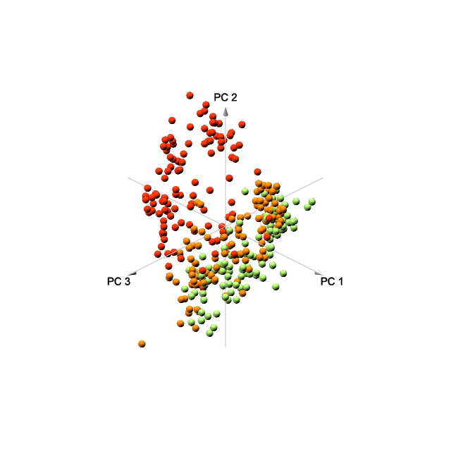

# Skin Transcriptome in Time and Space

## Abstract

## Introduction

## Results

```{r load package, echo=FALSE, message=FALSE, warning=FALSE}
library(tibble)
library(dplyr)
library(tidyr)
library(readr)
library(stringr)
library(ggplot2)
library(purrr)
library(tidybulk)
library(tidySummarizedExperiment)
library(ComplexHeatmap)
library(DT)
library(BiocParallel)
library(DESeq2)
library(enrichR)
library(ggpubr)
knitr::opts_chunk$set(message = FALSE, warning = FALSE, echo = FALSE)
```

```{r load data}
# read raw counts ---------------------------------------
counts <-
  data.table::fread("../multiomics-ad-transcriptomics/data/counts/counts_gene_name_redo.txt.gz") %>% 
  mutate(Chr = Chr %>% str_extract("chr\\w{1,}(?=;)|chr\\w{1,}$"), #keeps only 1
         Strand = Strand %>% str_extract("\\+|\\-"),               #keeps only 1
         Start = Start %>% str_extract("\\d{1,}(?=;)|\\d{1,}$"),   #keeps only 1
         End = End %>% str_extract("\\d{1,}(?=;)|\\d{1,}$")) %>%   #keeps only 1
  filter(!Geneid %>% 
           stringr::str_detect("\\d{1,}P$|\\d{1,}P\\d{1,}$|\\.|-AS\\d{1}|-DT")) %>% # apply gene filtering (pseudo genes, antisense genese, DT genes)
  dplyr::rename_with(str_extract, starts_with("/home/projects/"), pattern = "NG-[:graph:]{1,}$")

# lib to merge -------------
lib_id <- colnames(counts)[-1:-6] %>% str_extract("lib\\d{1,}") # extract lib id
lib_id_t <- table(lib_id)
lib_id_merge <- lib_id_t[(lib_id_t != 1)] %>% rownames() #lib_ids to be merged

# merge technical replicates -------------------------------------------
source("../multiomics-ad-transcriptomics/R/helper.R")

counttable_LibMerged <- 
  bind_cols(counts[, 1:6], 
            counttable_merge_library_fun(counts %>% dplyr::select(-1:-6), lib_id_merge)) 

# clinical records ------------------------
clinical_records <- 
  readr::read_csv("../multiomics-ad-transcriptomics/data/LEO-AD-metadata.csv") %>% 
  mutate(id = id %>% str_replace("-", "_"),
         JOIN_ID = paste(id, paste0("0",visit_no), sep="_"))

extensive_meta <-
  readr::read_csv("../multiomics-ad-transcriptomics/data/RNAseq_sample_annotation(extensive).csv")
```

```{r SummarizedExperiment}

# revised biopsy area by Tanja
revised_biopsy_area <- 
  readr::read_csv("../multiomics-ad-transcriptomics/data/tanja_replicate_location.csv") %>% 
  mutate(biopsy_area = biopsy_area %>% str_replace_all(" ", "_"))

# revise space infomation
biopsy_area <- 
  extensive_meta %>% 
  select(BAM_ID, biopsy_area_old = biopsy_area) %>% 
  left_join(revised_biopsy_area %>% select(BAM_ID, biopsy_area)) %>% 
  mutate(biopsy_area = ifelse(is.na(biopsy_area), biopsy_area_old, biopsy_area)) %>% 
  mutate(biopsy_area = ifelse(biopsy_area == "læg", "leg", biopsy_area)) %>% 
  select(-biopsy_area_old) %>% 
  add_case(BAM_ID = "NG-23830_01_AD_07_BI_LS_01_E9_lib390881_6751_1.bam",
           biopsy_area = "arm")

# se col_data
col_data <-
  tibble(
    # definingn metadata --------------------------------------
    BAM_ID = colnames(counttable_LibMerged)[-1:-6]) %>% 
    mutate(sequencing_batch = BAM_ID %>% str_extract("NG-\\d{1,}"),
           group = BAM_ID %>% str_extract("AD|CO") %>% 
               forcats::fct_relevel(c("CO", "AD")),
           subject = BAM_ID %>% str_extract("(AD|CO)_\\d{2,}"),
           visit = BAM_ID %>% str_extract("\\d{2,}_(AD|CO)") %>% str_extract("\\d{2,}"),
           skin_type = BAM_ID %>% str_replace("TS", "LS") %>% str_extract("NN|NL|LS") %>% forcats::fct_relevel(c("NN", "NL", "LS")),
           replicate_ID = BAM_ID %>% str_replace("TS_BI", "BI_LS") %>% str_extract("(NN|NL|LS)_\\d{2,}") %>% str_extract("\\d{2,}"),
           library_ID = BAM_ID %>% str_extract("lib\\d{1,}"),
           sequencing_id = BAM_ID %>% str_extract("\\d{4}_(1|2)"),
           JOIN_ID = base::paste(subject, visit, sep = "_")) %>%
    left_join(clinical_records %>% select(id, gender) %>% filter(!is.na(gender)), by=c("subject"="id")) %>%
    left_join(clinical_records %>% select(JOIN_ID, scorad, scorad_objective, easi_total_score, date_visit)) %>% 
    select(-JOIN_ID) %>% 
    mutate(gender = gender %>% forcats::fct_relevel(c("female", "male"))) %>% 
    left_join(extensive_meta %>% select(BAM_ID, rna_quality, visit_quarter)) %>% 
    left_join(biopsy_area)

# Summarized Experiment--------------------
se <- SummarizedExperiment::SummarizedExperiment(
  assays = list(counts = counttable_LibMerged %>% select(-1:-6) %>% as.matrix),
  colData = col_data
)
names(se) <- counttable_LibMerged$Geneid
```

```{r filtering}
# filter out samples ----------------
se <- se[, se$BAM_ID != (assay(se) %>% colSums() %>% which.min %>% names)] # 392
se <- se[, !se$library_ID %in% c("lib390174", "lib390716")] # 390
```

```{r revise some sp info}
index_ad03v01ls01 <-
  which(colData(se)$subject == "AD_03" &
        colData(se)$visit == "01" &
        colData(se)$skin_type == "LS" &
        colData(se)$replicate_ID == "01")
colData(se)$skin_type[index_ad03v01ls01] <- "NL"

index_ad03v01nl01 <-
  which(colData(se)$subject == "AD_03" &
          colData(se)$visit == "01" &
          colData(se)$skin_type == "NL" &
          colData(se)$replicate_ID == "01")
colData(se)$skin_type[index_ad03v01nl01] <- "LS"

index_ad13v03nl01 <-
  which(colData(se)$subject == "AD_13" &
        colData(se)$visit == "03" &
        colData(se)$skin_type == "NL" &
        colData(se)$replicate_ID == "01")
colData(se)$visit[index_ad13v03nl01] <- "05"
colData(se)$skin_type[index_ad13v03nl01] <- "LS"
colData(se)$replicate_ID[index_ad13v03nl01] <- "02"

index_ad13v05ls02 <-
  which(colData(se)$subject == "AD_13" &
        colData(se)$visit == "05" &
        colData(se)$skin_type == "LS" &
        colData(se)$replicate_ID == "02")
colData(se)$visit[index_ad13v05ls02] <- "03"
colData(se)$skin_type[index_ad13v05ls02] <- "NL"
colData(se)$replicate_ID[index_ad13v05ls02] <- "01"
```

```{r Sample QC}
sample_qc_record_edited <-
  readr::read_csv("data/sample_qc_record - sample_qc_record.csv")
```

```{r exclude}
exclude_BAM <- 
  colData(se) %>% as_tibble() %>% 
  select(BAM_ID, subject, visit, skin_type, replicate_ID) %>%
  left_join(sample_qc_record_edited) %>% 
  filter(exclude == TRUE) %>% pull(BAM_ID)
```

```{r generate new se}
se <- se[, !se$BAM_ID %in% exclude_BAM]

se_prifilt <- se

# filter out genes 
se <- se %>% 
  keep_abundant(factor_of_interest = skin_type) %>% 
  scale_abundance()

```

## generate KRTAP
```{r KRTAP}
se_KRTAP <- se_prifilt %>% 
  keep_abundant(factor_of_interest = skin_type, minimum_proportion = .1) %>%
  scale_abundance()
# KRTAP_index <- se_KRTAP %>% rownames() %>% str_detect("KRTAP5-|KRTAP10-4")
# se_KRTAP <- se_KRTAP[KRTAP_index,]
# sum(KRTAP_index)
```

```{r KRTAP variance}
se_KRTAP

KRTAP_hair <-
  se_KRTAP %>% filter(feature %in% c(paste0("KRTAP5-", 1:11), "KRTAP10-4")) %>% 
  group_by(feature) %>% summarise(mean_expr = mean(counts), sd_expr = sd(counts)) %>%   mutate(expr = ifelse(mean_expr >= 10, TRUE, FALSE))

se_KRTAP_filt <- 
  se_KRTAP %>% 
  filter(feature %in% (KRTAP_hair %>% filter(expr == TRUE) %>% pull(feature)))
```

```{r KRTAP correlation}
se_KRTAP_filt %>% assay(2) %>% t() %>% 
  cor(method = "pearson")
```
```{r}
se_KRTAP_filt %>% assay(2) %>% t() %>% 
  cor(method = "spearman")
```


```{r eval=FALSE}
KRTAP_filt_d <- 
  se_KRTAP_filt %>% assay(2) %>% log1p() %>% t() %>% scale() %>% t()

sample_site_color <- 
  colData(se_KRTAP_filt) %>% as_tibble() %>% pull(biopsy_area) %>% unique()

color <- RColorBrewer::brewer.pal(length(sample_site_color), "Set3")
names(color) <- sample_site_color

heatmap_annotation <- 
  HeatmapAnnotation(
    `Tissue type` = colData(se_KRTAP_filt) %>% as_tibble() %>% pull(skin_type), 
    `Sampling site` = colData(se_KRTAP_filt) %>% as_tibble() %>% pull(biopsy_area),
    col = list(`Tissue type` = pca_color,
               `Sampling site` = color),
    # simple_anno_size = unit(1, "cm"),
    annotation_legend_param = list(`Tissue type` = list(nrow = 1), 
                                                        # grid_height = unit(2, "cm"), 
                                                        # grid_width = unit(1, "cm"), 
                                                        # title_gp = gpar(fontsize = 16),
                                                        # labels_gp = gpar(fontsize = 16)),
                                   `Sampling site` = list(nrow = 2) 
                                                          # grid_height = unit(2, "cm"), 
                                                          # grid_width = unit(1, "cm"), 
                                                          # title_gp = gpar(fontsize = 16),
                                                          # labels_gp = gpar(fontsize = 16))
                                   ))

# grid_height = unit(1, "cm"), grid_width = unit(5, "mm")
                                               
heatmap <- ComplexHeatmap::Heatmap(KRTAP_filt_d,
                        name = "gene expression",
                        column_dend_reorder = TRUE,
                        # clustering_method_columns = "complete",
                        show_column_names = FALSE,
                        show_row_dend = FALSE,
                        row_names_gp = gpar(fontsize = min(12, 800 * 1.5 / dim(KRTAP_filt_d)[1])),
                        top_annotation = heatmap_annotation,
                        heatmap_legend_param = list(
                          # title_gp = gpar(fontsize = 14),
                          # labels_gp = gpar(fontsize = 12)
                          ))

draw(heatmap, heatmap_legend_side = "right",
     annotation_legend_side = "top", merge_legend = FALSE)


png("figure/heatmap_KRTAP.png", width = 480*4.5, height = 480*3, res=300)
draw(heatmap, heatmap_legend_side = "right",
     annotation_legend_side = "top", merge_legend = FALSE)
dev.off()

```

## Explorative data analysis
### Principle component analysis (PCA)
```{r PCA, include = TRUE}
PCA <- 
  se %>% 
  reduce_dimensions(method = "PCA", top = 350)

pca_color <- c("LS" = "#eb2d0c", "NL" = "#eb740c", "NN" = "#91cf60")
```

```{r PCA 3d plot, eval=FALSE}
attr(PCA, "internals")$PCA %>% 
  pca3d::pca3d(group = PCA$skin_type, col = pca_color, radius = 1.5, 
               shape = "s", 
               show.plane = FALSE)
rgl::snapshot3d("figure/pca3d.png", fmt="png")
rgl::rgl.postscript("figure/pca3d.pdf", fmt="pdf")
```

```{r include PCA 3d plot, dpi=300}

```

```{r cleaning}
rm(list = ls()[!ls() %in% c("se", "se_KRTAP", "pca_color")])
```

### Sample Distance and Similarity
```{r distance}
dist_st <- # st: skin_type
  lapply(c("LS", "NL", "NN"), function(x){
    se %>% 
      subset(select = skin_type == x) %>% 
      assay(2) %>% 
      t() %>% 
      dist() %>% 
      as.numeric()})

cosine_st <-
    lapply(c("LS", "NL", "NN"), function(x){
    se %>% 
      subset(select = skin_type == x) %>% 
      assay(2) %>% 
      coop::cosine() %>% 
      as.numeric()})

names(dist_st) <- c("LS", "NL", "NN")
names(cosine_st) <- c("LS", "NL", "NN")

dist_df <- plyr::ldply(dist_st, tibble, .name_repair = ~ c("dist"),
                       .id = "skin_type")

cosine_df <- plyr::ldply(cosine_st, tibble, .name_repair = ~ c("cos_dist"),
                       .id = "skin_type")

dist_df %>% 
  ggplot(aes(x = dist, 
             color = skin_type,
             fill = skin_type)) +
  geom_density(alpha = .6) +
  theme_classic() +
  ggsci::scale_color_nejm() + 
  ggsci::scale_fill_nejm() +
  xlab("Euclidean Distance")

cosine_df %>% 
  ggplot(aes(x = cos_dist, 
             color = skin_type,
             fill = skin_type)) +
  geom_density(alpha = .4) +
  theme_classic() +
  ggsci::scale_color_nejm() + 
  ggsci::scale_fill_nejm() +
  xlab("Cosine similarity")

```

### Heatmap
```{r heatmap, fig.align='center', dpi = 300}
se_heatmap <- se
# consolidate biopsy_area info
colData(se_heatmap)$biopsy_area <- colData(se)$biopsy_area %>% 
  str_extract("arm|back_of_knee|elbow|feet|hand|leg|wrist")

core_genes <- 
  tibble(gene_name = readr::read_csv("data/dge_v1_sig.csv") %>% 
  filter(contrast == "LSvsNL") %>% pull(gene_name)) %>% 
  pull(gene_name)

se_heatmap <- se_heatmap[core_genes,]

heatmap_data <- 
  se_heatmap %>% 
  keep_variable(.abundance = counts_scale,
                top = 50)

# heatmap_data_m <- heatmap_data %>% assay()

heatmap_data_m <-
  scale(assay(heatmap_data, 2) %>% t() %>% log1p(), 
        center = TRUE, scale = TRUE) %>% t()

sample_site_color <- 
  colData(heatmap_data) %>% as_tibble() %>% pull(biopsy_area) %>% unique()
color <- RColorBrewer::brewer.pal(length(sample_site_color), "Pastel2")
names(color) <- sample_site_color

heatmap_annotation <- 
  HeatmapAnnotation(
    `Tissue type` = colData(heatmap_data) %>% as_tibble() %>% pull(skin_type), 
    `Sampling site` = colData(heatmap_data) %>% as_tibble() %>% pull(biopsy_area),
    col = list(`Tissue type` = pca_color,
               `Sampling site` = color),
    # simple_anno_size = unit(1, "cm"),
    annotation_legend_param = list(`Tissue type` = list(nrow = 1, grid_height = unit(2, "cm"), 
                                                        grid_width = unit(1, "cm"), 
                                                        title_gp = gpar(fontsize = 16),
                                                        labels_gp = gpar(fontsize = 16)),
                                   `Sampling site` = list(nrow = 1, grid_height = unit(2, "cm"), 
                                                          grid_width = unit(1, "cm"), 
                                                          title_gp = gpar(fontsize = 16),
                                                          labels_gp = gpar(fontsize = 16))
                                   ))

# grid_height = unit(1, "cm"), grid_width = unit(5, "mm")
                                               
heatmap <- ComplexHeatmap::Heatmap(heatmap_data_m,
                        name = "gene expression",
                        column_dend_reorder = TRUE,
                        # clustering_method_columns = "complete",
                        show_column_names = FALSE,
                        show_row_dend = FALSE,
                        row_names_gp = gpar(fontsize = min(12, 800 * 1.5 / dim(heatmap_data_m)[1])),
                        top_annotation = heatmap_annotation,
                        heatmap_legend_param = list(
                          title_gp = gpar(fontsize = 14),
                          labels_gp = gpar(fontsize = 12)
                          ))

draw(heatmap, heatmap_legend_side = "right",
     annotation_legend_side = "top", merge_legend = FALSE)

# poster 480*8.1.5 480*10*1.5
# png("figure/heatmap.png", width = 480*8, height = 480*10, res=300)
# draw(heatmap, heatmap_legend_side = "right",
#      annotation_legend_side = "top", merge_legend = FALSE)
# dev.off()

```

```{r box plot for IL37, IL22, TNFRSF21, LINC01605}
IL22_37_TNFRSF21_LINC01605 <- se %>% 
  filter(feature %in% c("IL22", "IL37", "TNFRSF21", "LINC01605", "OSM", "OSMR"))

IL22_37_TNFRSF21_LINC01605_p <-
  IL22_37_TNFRSF21_LINC01605 %>% as_tibble() %>% 
  ggboxplot(x = "skin_type", y = "counts_scaled", add = "jitter", 
            facet.by = "feature", scale = "free", xlab = FALSE,
            ylab = FALSE, color = "skin_type", 
            palette = pca_color, legend.title = "",
            font.legend = c(14))

IL22_37_TNFRSF21_LINC01605_p

png("figure/IL22_37_TNFRSF21_LINC01605.png", width = 480*4, height = 480*4,res = 300)
IL22_37_TNFRSF21_LINC01605_p
dev.off()
```

```{r combine multiple plots, eval=FALSE}


```


## Differential gene expression (DGE) analysis

### Baseline

At the baseline, the number of dysregulated genes are:

* `LSvsNL`: `r knitr::load_cache("DGE-V1", "n_de_v1_LSvsNL_up")` up-regulated and `r knitr::load_cache("DGE-V1", "n_de_v1_LSvsNL_down")` down-regulated;
* `LSvsNN`: `r knitr::load_cache("DGE-V1", "n_de_v1_LSvsNN_up")` up-regulated and `r knitr::load_cache("DGE-V1", "n_de_v1_LSvsNN_down")` down-regulated
* `NLvsNN`: `r knitr::load_cache("DGE-V1", "n_de_v1_NLvsNN_up")` up-regulated and `r knitr::load_cache("DGE-V1", "n_de_v1_NLvsNN_down")` down-regulated

```{r pri-DGE-cleaning}
# cleaning
rm(list = ls()[!ls() %in% c("se", "se_KRTAP", "pca_color")])
register(MulticoreParam(future::availableCores() - 2))
```


```{r DGE-V1, cache=TRUE}

# V1 LSvsNL --------------------
se_v1_LSvsNL <- se[, se$visit == "01" & se$skin_type %in% c("LS", "NL")]
de_v1_LSvsNL <- DESeq2::DESeqDataSet(se_v1_LSvsNL, ~ subject + skin_type)
de_v1_LSvsNL <- DESeq2::DESeq(de_v1_LSvsNL, parallel = TRUE)


de_v1_LSvsNL_LFC <- lfcShrink(de_v1_LSvsNL, coef = "skin_type_LS_vs_NL", type = "apeglm", parallel = TRUE, quiet = TRUE)
de_v1_LSvsNL_result <- bind_cols(tibble(gene_name = rownames(se_v1_LSvsNL)), de_v1_LSvsNL_LFC %>% as_tibble())
de_v1_LSvsNL_result_s <- de_v1_LSvsNL_result %>% filter(padj < .05, abs(log2FoldChange) > 1)

# V1 LSvsNN --------------------
se_v1_LSvsNN <- se[, se$visit == "01" & se$skin_type %in% c("LS", "NN")]
de_v1_LSvsNN <- DESeq2::DESeqDataSet(se_v1_LSvsNN, ~ gender + skin_type) 
de_v1_LSvsNN <- DESeq2::DESeq(de_v1_LSvsNN, parallel = TRUE)

de_v1_LSvsNN_LFC <- lfcShrink(de_v1_LSvsNN, coef = "skin_type_LS_vs_NN", type = "apeglm", parallel = TRUE, quiet = TRUE)
de_v1_LSvsNN_result <- bind_cols(tibble(gene_name = rownames(de_v1_LSvsNN)), de_v1_LSvsNN_LFC %>% as_tibble())
de_v1_LSvsNN_result_s <- de_v1_LSvsNN_result %>% filter(padj < .05, abs(log2FoldChange) > 1)

# V1 LSvsNN --------------------
se_v1_NLvsNN <- se[, se$visit == "01" & se$skin_type %in% c("NL", "NN")]
de_v1_NLvsNN <- DESeq2::DESeqDataSet(se_v1_NLvsNN, ~ gender + skin_type) 
de_v1_NLvsNN <- DESeq2::DESeq(de_v1_NLvsNN, parallel = TRUE)

de_v1_NLvsNN_LFC <- lfcShrink(de_v1_NLvsNN, coef = "skin_type_NL_vs_NN", type = "apeglm", parallel = TRUE, quiet = TRUE)
de_v1_NLvsNN_result <- bind_cols(tibble(gene_name = rownames(de_v1_NLvsNN)), de_v1_NLvsNN_LFC %>% as_tibble())
de_v1_NLvsNN_result_s <- de_v1_NLvsNN_result %>% filter(padj < .05, abs(log2FoldChange) > 1)

# Consolidate the results -----
de_v1_c <-
  bind_rows(de_v1_LSvsNL_result_s %>% mutate(contrast = "LSvsNL"),
            de_v1_LSvsNN_result_s %>% mutate(contrast = "LSvsNN"),
            de_v1_NLvsNN_result_s %>% mutate(contrast = "NLvsNN")) %>% 
  mutate(direction = ifelse(log2FoldChange > 0, "up", "down"))

de_v1_c_s <-
  de_v1_c %>% 
  group_by(contrast, direction) %>% 
  summarise(n_dys = n())

# No of dysregulated genes
n_de_v1_LSvsNL_up <- de_v1_c_s %>% filter(contrast == "LSvsNL", direction == "up") %>% pull(n_dys)
n_de_v1_LSvsNL_down <- de_v1_c_s %>% filter(contrast == "LSvsNL", direction == "down") %>% pull(n_dys)
n_de_v1_LSvsNN_up <- de_v1_c_s %>% filter(contrast == "LSvsNN", direction == "up") %>% pull(n_dys)
n_de_v1_LSvsNN_down <- de_v1_c_s %>% filter(contrast == "LSvsNN", direction == "down") %>% pull(n_dys)
n_de_v1_NLvsNN_up <- de_v1_c_s %>% filter(contrast == "NLvsNN", direction == "up") %>% pull(n_dys)
n_de_v1_NLvsNN_down <- de_v1_c_s %>% filter(contrast == "NLvsNN", direction == "down") %>% pull(n_dys)
```

```{r write out, eval=FALSE}
de_v1_c %>% readr::write_csv("data/dge_v1_sig.csv")
```

```{r Consolidate Results display}

de_v1_c_d <- de_v1_c %>% 
  select(gene_name, log2FoldChange, padj, contrast) %>% 
  pivot_wider(names_from = contrast, values_from = c("log2FoldChange", "padj")) %>% 
  arrange(-log2FoldChange_LSvsNL)

t_container <- htmltools::withTags(table(
  class = 'display',
  thead(
    tr(
      th(rowspan = 2, 'Gene name'),
      th(colspan = 3, 'log2 Fold Change'),
      th(colspan = 3, 'Adjusted p-value')
    ),
    tr(
      lapply(rep(c('LSvsNL', 'LSvsNN', "NLvsNN"), 2), th)
    )
  )
))
  
datatable(de_v1_c_d, 
          colnames = c("gene name", "LSvsNL", "LSvsNN", "NLvsNN", "LSvsNL", "LSvsNN", "NLvsNN"), container = t_container, rownames = FALSE,
          options = list(pageLength = 20)) %>% 
  formatRound(de_v1_c_d %>% colnames %>% str_extract("log2FoldChange_\\w{6}") %>% purrr::discard(is.na)) %>% 
  formatSignif(de_v1_c_d %>% colnames %>% str_extract("padj_\\w{6}") %>% purrr::discard(is.na), digits = 3)
```

## Time Effect

I performed `Likelihood Ratio Test (LRT)` to test the genes react in the **condition-specific manner over time**, compared to baseline samples. 

> The likelihood-ratio test assesses the goodness of fit of two competing statistical models based on the ratio of their likelihoods, specifically one found by maximization over the entire parameter space and another found after imposing some constraint. If the constraint (i.e., the null hypothesis) is supported by the observed data, the two likelihoods should not differ by more than sampling error. @RN24

I first fit a `full model` (`~ subject + time + tissue_type + tissue_type * time`), then a `reduced model` (`~ subject + time + tissue_type`) by imposing `tissue_type * time` as the constraint. 

### Visit as time
```{r model time (visit), cache=TRUE}

# clean the environment for parallel 
# rm(list = ls()[ls() != "se"])

# LS vs NL
se_t_LSvsNL <- se %>% filter(skin_type %in% c("LS", "NL"))
de_t_LSvsNL <- DESeq2::DESeqDataSet(se_t_LSvsNL, ~ subject + visit + skin_type + skin_type * visit)

de_t_LSvsNL_m <- DESeq2::DESeq(de_t_LSvsNL, test="LRT", 
                              reduced = ~  subject + visit + skin_type,
                              parallel = TRUE) # takes very long time to run

de_t_LSvsNL_res <- 
  bind_cols(tibble(gene_name = names(de_t_LSvsNL_m)),
  DESeq2::results(de_t_LSvsNL_m) %>% as_tibble())

# LS vs NN
se_t_LSvsNN <-
  se %>%
  filter(skin_type %in% c("LS", "NN"))

de_t_LSvsNN <- DESeq2::DESeqDataSet(se_t_LSvsNN, ~  gender + visit + skin_type + skin_type * visit)

de_t_LSvsNN_m <- DESeq2::DESeq(de_t_LSvsNN, test="LRT", 
                              reduced = ~ gender + visit + skin_type,
                              parallel = TRUE)
de_t_LSvsNN_res <- 
  bind_cols(tibble(gene_name = names(de_t_LSvsNN_m)),
  DESeq2::results(de_t_LSvsNN_m) %>% as_tibble())

# NL vs NN
se_t_NLvsNN <-
  se %>%
  filter(skin_type %in% c("NL", "NN"))

de_t_NLvsNN <- DESeq2::DESeqDataSet(se_t_NLvsNN, ~  gender + visit + skin_type + skin_type * visit)

de_t_NLvsNN_m <- DESeq2::DESeq(de_t_NLvsNN, test="LRT", 
                              reduced = ~ gender + visit + skin_type,
                              parallel = TRUE)
de_t_NLvsNN_res <- 
  bind_cols(tibble(gene_name = names(de_t_NLvsNN_m)),
  DESeq2::results(de_t_NLvsNN_m) %>% as_tibble())
```

```{r model time(visit)-summary}
de_t_c_res <- 
  bind_rows(de_t_LSvsNL_res %>% mutate(contrast = "LSvsNL_v"),
            de_t_LSvsNN_res %>% mutate(contrast = "LSvsNN_v"),
            de_t_NLvsNN_res %>% mutate(contrast = "NLvsNN_v")) %>% 
  filter(padj < .05, abs(log2FoldChange) > 1)

de_t_c_res_s <-
  de_t_c_res %>% 
  group_by(contrast) %>% 
  summarise(n_dysregulated_genes = n())

de_t_c_res_s
```

```{r model time(visit)-vis}
heatmap_de_model <- 
  function(de_model){
    de_model_res <- 
      bind_cols(tibble(gene_name = names(de_model)),
                DESeq2::results(de_model) %>% as_tibble())
    betas <- coef(de_model)
    
    topGenes <- 
      de_model_res %>% filter(padj < .05) %>% arrange(padj) %>% 
      head(20) %>% pull(gene_name)
    
    col_to_plot <- colnames(betas) %>%
                   str_extract("(visit|visit_quarter)[:graph:]{1,}") %>% 
                   purrr::discard(is.na)
    mat <- betas[topGenes, col_to_plot]
    colnames(mat) <- col_to_plot %>% str_remove("visit_quarter") %>% str_remove("^_")
    thr <- 3 
    mat[mat < -thr] <- -thr
    mat[mat > thr] <- thr
    pheatmap(mat, 
             breaks=seq(from=-thr, to=thr, length=101), 
             cluster_col=FALSE, angle_col = "45", 
             main = deparse(substitute(de_model)) %>% str_extract("(LS|NL)vs(NL|NN)"))
  }

# betas <- coef(de_t_LSvsNL_m)
# colnames(betas)
# topGenes <- names(de_t_LSvsNN_m)[head(order(de_t_LSvsNN_res$padj),20)]
# mat <- betas[topGenes, -c(1,2)]
# thr <- 3 
# mat[mat < -thr] <- -thr
# mat[mat > thr] <- thr
# pheatmap(mat, breaks=seq(from=-thr, to=thr, length=101),
#          cluster_col=FALSE)
heatmap_de_model(de_t_LSvsNL_m)
heatmap_de_model(de_t_LSvsNN_m)
heatmap_de_model(de_t_NLvsNN_m)
```

```{r examples-time-effect}
SPAAR <- plotCounts(de_t_LSvsNL_m, 
                    gene = "SPAAR", 
                    c("skin_type", "visit"), returnData = TRUE)  %>% 
  mutate(skin_type = skin_type %>% forcats::fct_relevel(c("LS", "NL")))

SPAAR %>% 
  ggplot(aes(x = visit, y = count, color = skin_type, group = skin_type)) +
  geom_point() + stat_summary(fun = mean, geom = "line") + 
  scale_y_log10() +
  ggtitle("SPAAR (Small Regulatory Polypeptide Of Amino Acid Response)") +
  theme_classic()

KRT27 <- plotCounts(de_t_LSvsNN_m, 
                    gene = "KRT27", 
                    c("skin_type", "visit"), returnData = TRUE)  %>% 
  mutate(skin_type = skin_type %>% forcats::fct_relevel(c("LS", "NN")))


KRT27 %>% 
  ggplot(aes(x = visit, y = count, color = skin_type, group = skin_type)) +
  geom_point() + stat_summary(fun = mean, geom = "line") + 
  scale_y_log10() +
  ggtitle("KRT27") +
  theme_classic()

KRT9 <- plotCounts(de_t_LSvsNN_m, 
                    gene = "KRT9", 
                    c("skin_type", "visit"), returnData = TRUE)  %>% 
  mutate(skin_type = skin_type %>% forcats::fct_relevel(c("LS", "NN")))

KRT9 %>% 
  ggplot(aes(x = visit, y = count, color = skin_type, group = skin_type)) +
  geom_point() + stat_summary(fun = mean, geom = "line") + 
  scale_y_log10() +
  ggtitle("KRT9") +
  theme_classic()
```

### Quarter as time

```{r model time(quarter), cache=TRUE}
se <- se[, - which(is.na(se$visit_quarter))]
se_q_LSvsNL <- se[, se$skin_type %in% c("LS", "NL")]
se_q_LSvsNN <- se[, se$skin_type %in% c("LS", "NN")]
se_q_NLvsNN <- se[, se$skin_type %in% c("NL", "NN")]

# LS vs NL
de_q_LSvsNL <- DESeq2::DESeqDataSet(se_q_LSvsNL, ~ subject + visit_quarter + skin_type + skin_type * visit_quarter)

de_q_LSvsNL_m <- DESeq2::DESeq(de_q_LSvsNL, test="LRT", 
                              reduced = ~  subject + visit_quarter + skin_type,
                              parallel = TRUE)

de_q_LSvsNL_res <- 
  bind_cols(tibble(gene_name = names(de_q_LSvsNL_m)),
  DESeq2::results(de_q_LSvsNL_m) %>% as_tibble())

# LS vs NN
de_q_LSvsNN <- DESeq2::DESeqDataSet(se_q_LSvsNN, ~  gender + visit_quarter + skin_type + skin_type * visit_quarter)

de_q_LSvsNN_m <- DESeq2::DESeq(de_q_LSvsNN, test="LRT", 
                              reduced = ~ gender + visit_quarter + skin_type,
                              parallel = TRUE)
de_q_LSvsNN_res <- 
  bind_cols(tibble(gene_name = names(de_q_LSvsNN_m)),
  DESeq2::results(de_q_LSvsNN_m) %>% as_tibble())

# NL vs NN
de_q_NLvsNN <- DESeq2::DESeqDataSet(se_q_NLvsNN, ~  gender + visit_quarter + skin_type + skin_type * visit_quarter)

de_q_NLvsNN_m <- DESeq2::DESeq(de_q_NLvsNN, test="LRT", 
                              reduced = ~ gender + visit_quarter + skin_type,
                              parallel = TRUE)
de_q_NLvsNN_res <- 
  bind_cols(tibble(gene_name = names(de_q_NLvsNN_m)),
  DESeq2::results(de_q_NLvsNN_m) %>% as_tibble())
```

```{r model time(quarter)-summary}
de_q_c_res <- 
  bind_rows(de_q_LSvsNL_res %>% mutate(contrast = "LSvsNL_q"),
            de_q_LSvsNN_res %>% mutate(contrast = "LSvsNN_q"),
            de_q_NLvsNN_res %>% mutate(contrast = "NLvsNN_q")) %>% 
  filter(padj < .05, abs(log2FoldChange) > 1)

de_q_c_res_s <-
  de_q_c_res %>% 
  group_by(contrast) %>% 
  summarise(n_dys = n())

de_q_c_res_s
```

```{r model time(quarter)-vis}
heatmap_de_model(de_q_LSvsNN_m)
heatmap_de_model(de_q_NLvsNN_m)
```

### Over-representation analysis
```{r over-representation of time effect}
setEnrichrSite("Enrichr")
dbs <- c("GO_Molecular_Function_2021", 
         "GO_Cellular_Component_2021", 
         "GO_Biological_Process_2021",
         "KEGG_2021_Human", 
         "WikiPathway_2021_Human", 
         "Reactome_2016")

enriched <- 
  enrichr(de_q_c_res %>% filter(contrast == "LSvsNN_q") %>% pull(gene_name), dbs)

enriched %>% map_dfr(~.x) %>% filter(Adjusted.P.value < .05)

# de_t_c_res %>% filter(contrast == "LSvsNN_v") %>% pull(gene_name) 
```


## Space effect

### Consolidating biopsy area

```{r biopsy_area barplot}
se %>% colData() %>% as_tibble() %>% 
  ggplot(aes(biopsy_area, fill = skin_type)) + 
  geom_bar() + 
  theme_classic() +
  theme(axis.text.x = element_text(angle = 45, vjust = 0.7)) +
  ggtitle("Biopsy area before consolidating")
```

```{r consolidate biopsy_area}
se_space <- se

# consolidate biopsy_area info
colData(se_space)$biopsy_area <- colData(se)$biopsy_area %>% 
  str_extract("arm|back_of_knee|elbow|feet|hand|leg|wrist")

# readr::write_rds(se_space, "data/se_space.rds")

#
se_space %>% colData() %>% as_tibble() %>% 
  ggplot(aes(biopsy_area, fill = skin_type)) + 
  geom_bar() + 
  theme_classic() +
  theme(axis.text.x = element_text(angle = 45, vjust = 0.7)) +
  ggtitle("Biopsy area after consolidating")
```

### Variance Partition
```{r vp_biopsy_area}
se_space_500 <- se_space %>% keep_variable()
vp_space_500 <- variancePartition::fitExtractVarPartModel(
    assay(se_space_500, 2), 
    ~ (1|skin_type) + (1|subject) + (1|visit) + (1|gender) + (1|biopsy_area), 
    colData(se_space_500) %>% as_tibble()
    )
# readr::write_rds(se_space_500, "data/se_space_500.rds")
# readr::write_rds(vp_space_500, "data/vp_space_500.rds")
```

```{r vp_biopsy_area_vis}
variancePartition::plotVarPart(vp_space_500)
```

```{r}
top10_space_g <- 
  vp_space_500 %>% as_data_frame() %>% 
  mutate(gene_name = se_space_500 %>% rownames()) %>% 
  slice_max(biopsy_area, n = 10) %>% pull(gene_name)
```

```{r}
top10_space <- se_space_500 %>% filter(feature %in% top10_space_g)
top10_space %>% 
  ggplot(aes(biopsy_area, counts_scaled)) + geom_point() + geom_boxplot() +
  facet_wrap(~feature, scales = "free") +
  theme(axis.text.x = element_text(angle = 45, hjust = 1))
```

### Differential Gene Expression Analysis

```{r DGE spcace, cache=TRUE}
se_s_LSvsNL <- se_space %>% filter(skin_type %in% c("LS", "NL"))
de_s_LSvsNL <- DESeq2::DESeqDataSet(se_s_LSvsNL, ~ subject + visit + skin_type + skin_type * visit + biopsy_area)
de_s_LSvsNL_m <- DESeq2::DESeq(de_s_LSvsNL, parallel = TRUE)

de_s_LSvsNL_legvsarm_res <- 
  bind_cols(tibble(gene_name = names(de_s_LSvsNL_m)),
  DESeq2::results(de_s_LSvsNL_m, name = "biopsy_area_leg_vs_arm") %>% as_tibble())

biopsy_area_contrast <-
  resultsNames(de_s_LSvsNL_m) %>% 
  str_extract("biopsy_area_[:graph:]{1,}") %>% 
  purrr::discard(is.na)

register(MulticoreParam(parallel::detectCores() - 1))

biopsy_area_results <- 
  lapply(biopsy_area_contrast, function(x){
  bind_cols(tibble(gene_name = names(de_s_LSvsNL_m)),
  lfcShrink(de_s_LSvsNL_m, 
            coef = x, 
            parallel = TRUE) %>% as_tibble() %>% 
    mutate(contrast = x))
}) %>% purrr::map_dfr(~.x) %>% filter(padj < .05, abs(log2FoldChange) > 1) %>% 
  mutate(contrast = contrast %>% str_remove("biopsy_area_"))
```


```{r DGE space - DT vis}
biopsy_area_results %>% 
  datatable() %>% 
  formatRound(2:4) %>% 
  formatSignif(5:6)
```


#### Bioreplicate

```{r bioreplicate}

```


## Gene Set Analysis
```{r save data, eval=FALSE}
ls_gsa <- as.list(ls(pattern = "^de_v1_(LS|NL)vs(NL|NN)") %>% lapply(get))
names(ls_gsa) <- ls(pattern = "^de_v1_(LS|NL)vs(NL|NN)")
# saveRDS(ls_gsa, "data/de_v1.rds")
```

```{r gsa, eval=FALSE, echo=TRUE}

# calc gene rank

# gene rank
rank <- 
  tibble(gene_name = names(ls_gsa$se_v1_LSvsNL)) %>% 
  left_join(ls_gsa$de_v1_LSvsNL %>% pivot_transcript() %>% dplyr::select(gene_name = feature, WaldStatistic_skin_type_LS_vs_NL)) %>% 
  left_join(ls_gsa$de_v1_LSvsNN %>% pivot_transcript() %>% dplyr::select(gene_name = feature, WaldStatistic_skin_type_LS_vs_NN)) %>% 
  left_join(ls_gsa$de_v1_NLvsNN %>% pivot_transcript() %>% dplyr::select(gene_name = feature, WaldStatistic_skin_type_NL_vs_NN)) %>% 
  left_join(ls_gsa$de_v1_LSvsNL_result %>% mutate(rank_log2fc_LSvsNL = log2FoldChange * -log10(padj)) %>% dplyr::select(gene_name, rank_log2fc_LSvsNL)) %>% 
  left_join(ls_gsa$de_v1_LSvsNN_result %>% mutate(rank_log2fc_LSvsNN = log2FoldChange * -log10(padj)) %>% dplyr::select(gene_name, rank_log2fc_LSvsNN)) %>% 
  left_join(ls_gsa$de_v1_NLvsNN_result %>% mutate(rank_log2fc_NLvsNN = log2FoldChange * -log10(padj)) %>% dplyr::select(gene_name, rank_log2fc_NLvsNN)) %>% 
  pivot_longer(cols = !gene_name, names_to = "rank_type", values_to = "rank") %>% 
  group_by(rank_type) %>% nest() %>% 
  mutate(rank_vect = purrr::map(data, deframe)) 


fun_extract_g_symbol <- function(gene_df){
  gene_df %>% pull(gene_symbol)
}

# prepare gs --------------
extract_msigdb_sub <- function(subcat){
  gs_df <- msigdbr::msigdbr(species = "Homo sapiens", 
                            subcategory = subcat) %>% 
    group_by(gs_name) %>% tidyr::nest() %>% 
    mutate(gene_id = purrr::map(data, fun_extract_g_symbol)) %>% select(-data)
  gs_list <- gs_df$gene_id
  names(gs_list) <- gs_df$gs_name
  return(gs_list)
  }


gs_name <-
  c("CP:BIOCARTA", 
       "CP:KEGG", 
       "CP:PID", 
       "CP:REACTOME", 
       "CP:WIKIPATHWAYS", 
       "MIR:MIRDB", 
       "TFT:GTRD", 
       "GO:BP", 
       "GO:MF", 
       "IMMUNESIGDB")

gs_list <- lapply(gs_name, extract_msigdb_sub)
names(gs_list) <- gs_name

# prepare for gse analyse ----
gse_exp <- 
  expand.grid(rank = rank$rank_vect, 
              gs = gs_list)

name <- 
  expand.grid(ranktype = rank$rank_type, gs = gs_name) %>% 
  mutate(name = paste(gs, ranktype, sep = "_")) %>% 
  pull(name)

gse_res <- purrr::map2(gse_exp$rank,
                       gse_exp$gs,
            function(rank, gs){
  fgsea::fgsea(pathways = gs, 
               stats    = rank,
               minSize  = 15,
               maxSize  = 500, eps = 0) %>% 
  filter(padj < .05) %>% arrange(-NES)
}) 

names(gse_res) <- name

topPathwaysUp <- fgseaRes_gobp[ES > 0][head(order(pval), n=10), pathway]
topPathwaysDown <- fgseaRes_gobp[ES < 0][head(order(pval), n=10), pathway]
topPathways <- c(topPathwaysUp, rev(topPathwaysDown))
plotGseaTable(gobp_list[topPathways], rank_log2fc_padj, fgseaRes_gobp, 
              gseaParam=0.5)
```

```{r enrichR}
enrich_dbs <- c("GO_Molecular_Function_2018", "GO_Cellular_Component_2018",
                "GO_Biological_Process_2018", "KEGG_2019_Human", "WikiPathways_2019_Human")
enrich_result <-
  enrichr(ls_gsa$de_v1_LSvsNL_result_s$gene_name, databases = enrich_dbs)
```


## Cell Type Deconvolution
```{r MuSic}
library(MuSiC)
library(Biobase)
library(convert)

# Construct ExpressionSet for bulk RNA-seq

se_scaled <- se
# se_scaled <- 
assay(se_scaled) <- NULL

multiomics <- 
  as(se_scaled, "ExpressionSet")


# Construct ExpressionSet for scRNA-seq
emma_guttman <- readRDS(
  url("https://gitcdn.link/repo/tuhulab/cell-type-deconvolute/main/data/emma-gutmann/ExpressionSet.rds")
  )

multiomics_music <- music_prop(bulk.eset = multiomics, sc.eset = emma_guttman,
                               clusters = "cell_type", samples = "sample_name")


multiomics_results <-
  data.matrix(multiomics_music$Est.prop.weighted) %>% 
  as.data.frame() %>% rownames_to_column("BAM_ID") %>% 
  pivot_longer(!BAM_ID, names_to = "cell_type", values_to = "prop") %>% 
  left_join(colData(se_scaled) %>% as_tibble() %>% select(BAM_ID, group, subject, visit, skin_type, replicate_ID, gender, scorad, scorad_objective, easi_total_score, date_visit, rna_quality, visit_quarter, biopsy_area))

cell_type_rank <- 
  multiomics_results %>% group_by(cell_type) %>% 
  summarize(mean_prop = mean(prop)) %>% arrange(-mean_prop) %>% pull(cell_type)

exclude_low_KRT <-
  multiomics_results %>% 
  filter(cell_type == "Keratinocytes", prop < .11) %>% pull(BAM_ID)

multiomics_results <-
  multiomics_results %>% filter(!BAM_ID %in% exclude_low_KRT) %>% 
  mutate(cell_type = forcats::fct_relevel(cell_type, cell_type_rank),
         prop = prop * 100)

deconvolution_vis_group <- 
  multiomics_results %>% 
  ggplot(aes(skin_type, prop, color = skin_type)) +
  geom_jitter(width = .1) +
  geom_boxplot(alpha = .4) +
  facet_wrap(~cell_type, scales = "free") +
  theme_classic() +
  ggpubr::color_palette("jco")

deconvolution_vis_group
```

```{r appendix, eval=FALSE}
multiomics_results_sample <- 
  multiomics_results %>%
  mutate(plot_name = paste(subject, visit, skin_type, replicate_ID, sep = "_"))

multiomics_results_sample_count <-
  multiomics_results_sample$plot_name %>% table

multiomics_results_sample <-
  multiomics_results_sample %>% 
  filter(plot_name %in% names(which(multiomics_results_sample_count == 10)))

multiomics_results_vis_sample <- 
  multiomics_results_sample %>%  # filter(subject %in% c("AD_16", "CO_33")) %>% 
  arrange(plot_name) %>% 
  ggbarplot(x = "plot_name", y = "prop", fill = "cell_type", 
            xlab = "Sample", ylab = "Proportion(%)", palette = "npg") %>% 
  facet(facet.by = "subject", scales = "free") %>% 
  ggpar(xtickslab.rt = 90, font.tickslab = 6)

# pdf("figure/deconvolution_sample.pdf", height = 16.5 * 1.5, width = 11.7)
# multiomics_results_vis_sample
# dev.off()
```


```{r two samples}
multiomics_results_twosamples <- 
  multiomics_results %>%
  filter(subject %in% c("AD_16", "CO_33")) %>% 
  ggbarplot(x = "replicate_ID", y = "prop", fill = "cell_type", 
            facet.by = c("skin_type", "visit"),
            panel.labs = list(visit = c("Visit 1", "Visit 2", "Visit 3", "Visit 4", "Visit 5"), 
                              skin_type = c("CO33-NN", "AD16-NL", "AD16-LS")),
            xlab = "Replicate", ylab = "Proportion(%)") +
  fill_palette("npg")

multiomics_results_vis_two_sample <- 
  multiomics_results_twosamples %>% 
  ggpar(legend = "bottom", 
        legend.title = "Cell type",
        font.legend = 7, 
        font.tickslab = 6, 
        main = "Cell Deconvolution for two examples (subject AD_16 and CO_33)",
        rotate = TRUE)


multiomics_results_vis_two_sample

```


## Varian Partition (to work)

```{r vpall, eval=FALSE}
vp <- 
  variancePartition::fitExtractVarPartModel(
    assay(se, 2), 
    ~ (1|skin_type) + (1|subject) + (1|visit) + (1|gender), 
    colData(se) %>% as_tibble()
    )
variancePartition::plotVarPart(vp)
```

```{r vp500, eval=FALSE}
se_500 <- se %>% keep_variable()
vp_500 <- variancePartition::fitExtractVarPartModel(
    assay(se_500, 2), 
    ~ (1|skin_type) + (1|subject) + (1|visit) + (1|gender), 
    colData(se_500) %>% as_tibble()
    )
variancePartition::plotVarPart(vp_500)
```

```{r VP core gene, cache=TRUE}
# se_core <- readr::read_rds("data/se_core.rds")
se_core <- se[names(se) %in% (de_v1_c %>% pull(gene_name)), ]
vp_core <- variancePartition::fitExtractVarPartModel(
    assay(se_core, 2), 
    ~ (1|skin_type) + (1|subject) + (1|visit_quarter) + (1|gender), 
    colData(se_core) %>% as_tibble()
    )
# readr::write_rds(se_core, "data/se_core.rds")
# readr::write_rds(vp_core, "data/vp_core.rds")

variancePartition::plotVarPart(vp_core)

variancePartition::plotPercentBars(
  head(vp_core[order(vp_core$skin_type, decreasing = TRUE),], 15))

# cytokine
cytokine_vp <- vp_core %>% 
  data.frame() %>% 
  rownames_to_column(var = "gene_name") %>% 
  filter(gene_name %>% str_detect("^IL\\d{1}|TNF|EBI|IFN|OSMR")) %>% 
  arrange(-skin_type) %>% 
  pivot_longer(cols = !gene_name, names_to = "term") %>% 
  filter(term == "skin_type") %>% 
  mutate(var_explained = round(value * 100, 2)) %>% 
  filter(var_explained > 10)

cytokine_vp_P <- ggpubr::ggdotchart(
  cytokine_vp, x = "gene_name", y = "var_explained",
  color = "#FC4E07",
  xlab = "",
  sorting = "descending",
  rotate = TRUE, 
  add = "segments",
  # label = IL_vp$value,
  # font.label = list(color = "white", size = 3, vjust = 0.5),
  ggtheme = ggpubr::theme_pubr(),
  dot.size = 4,
  ylab = "Var% explained by atopic dermatitis tissue"
)

# LINC
linc_vp <- vp_core %>% 
  data.frame() %>% 
  rownames_to_column(var = "gene_name") %>% 
  filter(gene_name %>% str_detect("^LINC")) %>% 
  arrange(-skin_type) %>% 
  pivot_longer(cols = !gene_name, names_to = "term") %>% 
  filter(term == "skin_type") %>% 
  mutate(var_explained = round(value * 100, 2)) %>% 
  slice_max(order_by = var_explained, n = 15)

linc_vp_P <- ggpubr::ggdotchart(
  linc_vp, x = "gene_name", y = "var_explained",
  color = "#FC4E07",
  xlab = "",
  sorting = "descending",
  rotate = TRUE, 
  add = "segments",
  # label = IL_vp$value,
  # font.label = list(color = "white", size = 3, vjust = 0.5),
  ggtheme = ggpubr::theme_pubr(),
  dot.size = 4,
  ylab = "Var% explained by atopic dermatitis tissue"
)

# output
# png("figure/vp_cytokine.png", width = 480*4, height= 480*4, res = 300)
# cytokine_vp_P
# dev.off()
# 
# png("figure/vp_linc.png", width = 480*4, height= 480*2.5, res = 300)
# linc_vp_P
# dev.off()


```

```{r}
vp_core_t <- 
  vp_core %>% 
  data.frame() %>% 
  rownames_to_column(var = "gene_name") %>% tibble()

vp_core <- de_v1_c_d %>%   
  left_join(vp_core_t %>% select(gene_name, skin_type) %>% rename(var_explained = skin_type)) %>% 
  mutate(var_explained)

```

```{r analyze individual factor}
vp_core_t %>% 
  filter(skin_type > .05, subject > .05) %>% 
  mutate(skin_type_subject_ratio = skin_type / (subject + .01)) %>% 
  arrange(skin_type_subject_ratio)
```

```{r boxplot - individual}
boxplot_individual_d <- se %>% 
  filter(feature %in% c("DOK7", "PSG5", "IGHA2", "PDZD7"))

boxplot_individual_p <-
  boxplot_individual_d %>% as_tibble() %>% 
  ggboxplot(x = "skin_type", y = "counts_scaled", add = "jitter", 
            facet.by = "feature", scale = "free", xlab = FALSE,
            ylab = FALSE, color = "skin_type", 
            palette = pca_color, legend.title = "",
            font.legend = c(14))

boxplot_individual_p
```


```{r}
vp_container <- htmltools::withTags(table(
  class = 'display',
  thead(
    tr(
      th(rowspan = 2, 'Gene name'),
      th(colspan = 3, 'log2 Fold Change'),
      th(colspan = 3, 'Adjusted p-value'),
      th(rowspan = 2, 'Var% explained by AD tissue type')
    ),
    tr(
      lapply(rep(c('LSvsNL', 'LSvsNN', "NLvsNN"), 2), th)
    )
  )
))


datatable(vp_core, 
          colnames = c("gene name", "LSvsNL", "LSvsNN", "NLvsNN", "LSvsNL", "LSvsNN", "NLvsNN", "Var% explained by AD tissue type"), 
          container = vp_container, rownames = FALSE,
          options = list(pageLength = 20)) %>% 
  formatRound(vp_core %>% colnames %>% str_extract("log2FoldChange_\\w{6}") %>% purrr::discard(is.na)) %>% 
  formatSignif(vp_core %>% colnames %>% str_extract("padj_\\w{6}") %>% purrr::discard(is.na), digits = 3) %>% 
  formatPercentage("var_explained", 2)
```


