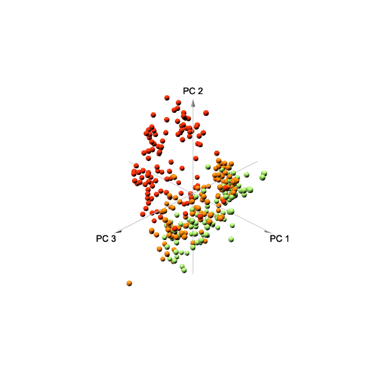

# Skin Transcriptome in Time and Space

## Abstract

## Introduction

## Results

```{r load package, echo=FALSE, message=FALSE, warning=FALSE}
library(tibble)
library(dplyr)
library(tidyr)
library(readr)
library(stringr)
library(ggplot2)
library(purrr)
library(tidybulk)
library(tidySummarizedExperiment)
library(ComplexHeatmap)
library(DT)
library(BiocParallel)
library(DESeq2)
library(enrichR)
library(ggpubr)
library(MuSiC)
library(Biobase)
library(convert)
knitr::opts_chunk$set(message = FALSE, warning = FALSE, echo = FALSE)
pca_color <- c("LS" = "#eb2d0c", "NL" = "#eb740c", "NN" = "#91cf60")
register(MulticoreParam(future::availableCores() - 2))
```

```{r load data}
clinical_records <- 
  readr::read_csv("../multiomics-ad-transcriptomics/data/LEO-AD-metadata.csv") %>% 
  mutate(id = id %>% str_replace("-", "_"),
         JOIN_ID = paste(id, paste0("0",visit_no), sep="_"))
se <- readr::read_rds("data/se.rds")
se_krtap <- readr::read_rds("data/se_krtap.rds")
```

```{r baseline characteristics}
baseline_disease_severity <- 
  clinical_records %>% filter(visit_no == 1, group == "AD") %>% 
  summarise(mean_scorad = mean(scorad, na.rm = TRUE) %>% round(1),
            mean_easi = mean(easi_total_score) %>% round(2))
```

### Baseline characteristics

The atopic dermatitis (AD) group were characterized by mild to moderate disease severity, with mean eczema area and severity index (EASI) `r baseline_disease_severity$mean_easi` and mean SCORing Atopic Dermatitis (SCORAD) `r baseline_disease_severity$mean_scorad`. 
At the baseline, the AD and healthy control (HC) group showed no statistical difference in gender, age, BMI, and total blood IgE (Table: \@ref(tab:baseline-statistics-table)). 
Individual data points were reported in the supplementary table \@ref(tab:individual-data-table).

### Transcriptome architecture and components of AD

```{r PCA}
PCA <- 
  se %>% 
  reduce_dimensions(method = "PCA", top = 350)
```

```{r PCA 3d, eval=FALSE}
attr(PCA, "internals")$PCA %>% 
  pca3d::pca3d(group = PCA$skin_type, col = pca_color, radius = 1.5, 
               shape = "s", 
               show.plane = FALSE)
rgl::snapshot3d("figure/pca3d.png", fmt="png")
rgl::rgl.postscript("figure/pca3d.pdf", fmt="pdf")
```

```{r PCA-3d-plot, fig.cap = "pca 3d plot", dpi=300, out.width='80%'}

```

```{r cleaning}
rm(list = ls()[!ls() %in% c("se", "se_krtap", "pca_color")])
```

We obtained `r ncol(se)` skin transcriptomes after data cleaning. The top three principal components could separate the different tissue types (fig-\@ref(fig:PCA-3d-plot)). The heatmap showed AD lesional skins (LS) can be separated from AD non-lesional skins (NL) and healthy control skins (HC), but, NL and HC can't be separated (fig-\@ref(fig:heatmap-top-50)). LS tissues showed higher heterogeneity than NL and HC tissues (fig-\@ref(fig:distance)).

```{r heatmap-top-50, fig.cap = "Heatmap", fig.align='center', dpi = 300, fig.height=8}
se_heatmap <- se
core_genes <- 
  tibble(gene_name = readr::read_csv("data/dge_v1_sig.csv") %>% 
  filter(contrast == "LSvsNL") %>% pull(gene_name)) %>% 
  pull(gene_name)
se_heatmap <- se_heatmap[core_genes[core_genes %in% rownames(se_heatmap)],]
heatmap_data <- 
  se_heatmap %>% 
  keep_variable(.abundance = counts_scale,
                top = 50)
heatmap_data_m <-
  scale(assay(heatmap_data, 2) %>% t() %>% log1p(), 
        center = TRUE, scale = TRUE) %>% t()
sample_site_color <- 
  colData(heatmap_data) %>% as_tibble() %>% pull(biopsy_area) %>% unique()
color <- RColorBrewer::brewer.pal(length(sample_site_color), "Pastel2")
names(color) <- sample_site_color
heatmap_annotation <- 
  HeatmapAnnotation(
    `Tissue type` = colData(heatmap_data) %>% as_tibble() %>% pull(skin_type), 
    `Sampling site` = colData(heatmap_data) %>% as_tibble() %>% pull(biopsy_area),
    col = list(`Tissue type` = pca_color,
               `Sampling site` = color),
    # simple_anno_size = unit(1, "cm"),
    annotation_legend_param = list(`Tissue type` = list(nrow = 1, 
                                                        # grid_height = unit(2, "cm"), 
                                                        # grid_width = unit(1, "cm"), 
                                                        # title_gp = gpar(fontsize = 16),
                                                        labels_gp = gpar(fontsize = 9)),
                                   `Sampling site` = list(nrow = 1,
                                                          # grid_height = unit(2, "cm"), 
                                                          # grid_width = unit(1, "cm"), 
                                                          # title_gp = gpar(fontsize = 16),
                                                          labels_gp = gpar(fontsize = 9))
                                   ))

heatmap <- ComplexHeatmap::Heatmap(heatmap_data_m,
                        name = "gene expression",
                        column_dend_reorder = TRUE,
                        # clustering_method_columns = "complete",
                        show_column_names = FALSE,
                        show_row_dend = FALSE,
                        row_names_gp = gpar(fontsize = min(10, 800 * 1.5 / dim(heatmap_data_m)[1])),
                        top_annotation = heatmap_annotation,
                        heatmap_legend_param = list(
                          title_gp = gpar(fontsize = 14),
                          labels_gp = gpar(fontsize = 12)
                          ))

draw(heatmap, heatmap_legend_side = "right",
     annotation_legend_side = "top", merge_legend = FALSE)

# poster 480*8.1.5 480*10*1.5
# png("figure/heatmap.png", width = 480*8, height = 480*10, res=300)
# draw(heatmap, heatmap_legend_side = "right",
#      annotation_legend_side = "top", merge_legend = FALSE)
# dev.off()
```

```{r example-boxplot-heatmap}
example_boxplot_heatmap <- 
  se %>% 
  filter(feature %in% c("IL22", "IL37", "TNFRSF21", "LINC01605", "OSM", "OSMR"))

example_boxplot_heatmap_p <-
  example_boxplot_heatmap %>% as_tibble() %>% 
  ggboxplot(x = "skin_type", y = "counts_scaled", add = "jitter", 
            facet.by = "feature", scale = "free", xlab = FALSE,
            ylab = FALSE, color = "skin_type", 
            palette = pca_color, legend.title = "",
            font.legend = c(14))

example_boxplot_heatmap_p

# png("figure/IL22_37_TNFRSF21_LINC01605.png", width = 480*4, height = 480*4,res = 300)
# IL22_37_TNFRSF21_LINC01605_p
# dev.off()
```

## Baseline

We generated AD disease signature which consists of `r knitr::load_cache("DGE-V1", "n_de_v1_LSvsNL")` (LS vs NL), `r knitr::load_cache("DGE-V1", "n_de_v1_LSvsNN")` (LS vs HC), and `r knitr::load_cache("DGE-V1", "n_de_v1_NLvsNN")` (NL vs HC) differentially expressed genes (\@ref(ad-dge-v1)). 

### Gene set enrichment analysis
The skin transcriptome was enriched for (Fig-S1).

We also identified enrichment of transcription factor targets and microRNA targets, including MAML1 (related with NOTCH signaling), PSMB5, and TRIP13 target genes; MIR6768_5P, MIR6833_3P, MIR6873_3P targets ((Table: \@ref(tab:gsea-regulatory))).

## Variance analysis

IL37 was the best explained cytokine family gene. IL37 showed a decrease trend in HC > NL > LS. We also observed a few long noncoding RNA (lincRNA) with high variance can be explained by AD (Fig 2).

### Time Effect plays a minor role in transcriptome variation

Likelihood Ratio Test (LRT) results showed no genes reacted in the condition-specific manner over time, compared to baseline samples.


I first fit a `full model` (`~ subject + time + tissue_type + tissue_type * time`), then a `reduced model` (`~ subject + time + tissue_type`) by imposing `tissue_type * time` as the constraint.

### Hair variance
```{r generate heatmap for krtap, eval=FALSE}
KRTAP_filt_d <- 
  se_krtap %>% assay(2) %>% log1p() %>% t() %>% scale() %>% t()

sample_site_color <- 
  colData(se_krtap) %>% as_tibble() %>% pull(biopsy_area) %>% unique()

color <- RColorBrewer::brewer.pal(length(sample_site_color), "Set3")
names(color) <- sample_site_color

heatmap_annotation <- 
  HeatmapAnnotation(
    `Tissue type` = colData(se_krtap) %>% as_tibble() %>% pull(skin_type), 
    `Sampling site` = colData(se_krtap) %>% as_tibble() %>% pull(biopsy_area),
    col = list(`Tissue type` = pca_color,
               `Sampling site` = color),
    # simple_anno_size = unit(1, "cm"),
    annotation_legend_param = list(`Tissue type` = list(nrow = 1), 
                                                        # grid_height = unit(2, "cm"), 
                                                        # grid_width = unit(1, "cm"), 
                                                        # title_gp = gpar(fontsize = 16),
                                                        # labels_gp = gpar(fontsize = 16)),
                                   `Sampling site` = list(nrow = 2) 
                                                          # grid_height = unit(2, "cm"), 
                                                          # grid_width = unit(1, "cm"), 
                                                          # title_gp = gpar(fontsize = 16),
                                                          # labels_gp = gpar(fontsize = 16))
                                   ))

# grid_height = unit(1, "cm"), grid_width = unit(5, "mm")
                                               
heatmap <- ComplexHeatmap::Heatmap(KRTAP_filt_d,
                        name = "gene expression",
                        column_dend_reorder = TRUE,
                        # clustering_method_columns = "complete",
                        show_column_names = FALSE,
                        show_row_dend = FALSE,
                        row_names_gp = gpar(fontsize = min(12, 800 * 1.5 / dim(KRTAP_filt_d)[1])),
                        top_annotation = heatmap_annotation,
                        heatmap_legend_param = list(
                          # title_gp = gpar(fontsize = 14),
                          # labels_gp = gpar(fontsize = 12)
                          ))

draw(heatmap, heatmap_legend_side = "right",
     annotation_legend_side = "top", merge_legend = FALSE)


# png("figure/heatmap_KRTAP.png", width = 480*4.5, height = 480*3, res=300)
# draw(heatmap, heatmap_legend_side = "right",
#      annotation_legend_side = "top", merge_legend = FALSE)
# dev.off()
```

```{r eval=FALSE}
psych::pairs.panels(se_krtap %>% assay(2) %>% log1p() %>% t())
```


### Visit as time

```{r model time (visit), eval=FALSE, cache=TRUE}

# clean the environment for parallel 
# rm(list = ls()[ls() != "se"])
# LS vs NL
se_t_LSvsNL <- se %>% filter(skin_type %in% c("LS", "NL"))
de_t_LSvsNL <- DESeq2::DESeqDataSet(se_t_LSvsNL, ~ subject + visit + skin_type + skin_type * visit)

de_t_LSvsNL_m <- DESeq2::DESeq(de_t_LSvsNL, test="LRT", 
                              reduced = ~  subject + visit + skin_type,
                              parallel = TRUE) # takes very long time to run

de_t_LSvsNL_res <- 
  bind_cols(tibble(gene_name = names(de_t_LSvsNL_m)),
  DESeq2::results(de_t_LSvsNL_m) %>% as_tibble())

# LS vs NN
se_t_LSvsNN <-
  se %>%
  filter(skin_type %in% c("LS", "NN"))

de_t_LSvsNN <- DESeq2::DESeqDataSet(se_t_LSvsNN, ~  gender + visit + skin_type + skin_type * visit)

de_t_LSvsNN_m <- DESeq2::DESeq(de_t_LSvsNN, test="LRT", 
                              reduced = ~ gender + visit + skin_type,
                              parallel = TRUE)
de_t_LSvsNN_res <- 
  bind_cols(tibble(gene_name = names(de_t_LSvsNN_m)),
  DESeq2::results(de_t_LSvsNN_m) %>% as_tibble())

# NL vs NN
se_t_NLvsNN <-
  se %>%
  filter(skin_type %in% c("NL", "NN"))

de_t_NLvsNN <- DESeq2::DESeqDataSet(se_t_NLvsNN, ~  gender + visit + skin_type + skin_type * visit)

de_t_NLvsNN_m <- DESeq2::DESeq(de_t_NLvsNN, test="LRT", 
                              reduced = ~ gender + visit + skin_type,
                              parallel = TRUE)
de_t_NLvsNN_res <- 
  bind_cols(tibble(gene_name = names(de_t_NLvsNN_m)),
  DESeq2::results(de_t_NLvsNN_m) %>% as_tibble())
```

```{r model time(visit)-summary, eval=FALSE}
de_t_c_res <- 
  bind_rows(de_t_LSvsNL_res %>% mutate(contrast = "LSvsNL_v"),
            de_t_LSvsNN_res %>% mutate(contrast = "LSvsNN_v"),
            de_t_NLvsNN_res %>% mutate(contrast = "NLvsNN_v")) %>% 
  filter(padj < .05, abs(log2FoldChange) > 1)

de_t_c_res_s <-
  de_t_c_res %>% 
  group_by(contrast) %>% 
  summarise(n_dysregulated_genes = n())

de_t_c_res_s
```

```{r model time(visit)-vis, eval=FALSE}
heatmap_de_model <- 
  function(de_model){
    de_model_res <- 
      bind_cols(tibble(gene_name = names(de_model)),
                DESeq2::results(de_model) %>% as_tibble())
    betas <- coef(de_model)
    
    topGenes <- 
      de_model_res %>% filter(padj < .05) %>% arrange(padj) %>% 
      head(20) %>% pull(gene_name)
    
    col_to_plot <- colnames(betas) %>%
                   str_extract("(visit|visit_quarter)[:graph:]{1,}") %>% 
                   purrr::discard(is.na)
    mat <- betas[topGenes, col_to_plot]
    colnames(mat) <- col_to_plot %>% str_remove("visit_quarter") %>% str_remove("^_")
    thr <- 3 
    mat[mat < -thr] <- -thr
    mat[mat > thr] <- thr
    pheatmap(mat, 
             breaks=seq(from=-thr, to=thr, length=101), 
             cluster_col=FALSE, angle_col = "45", 
             main = deparse(substitute(de_model)) %>% str_extract("(LS|NL)vs(NL|NN)"))
  }

# betas <- coef(de_t_LSvsNL_m)
# colnames(betas)
# topGenes <- names(de_t_LSvsNN_m)[head(order(de_t_LSvsNN_res$padj),20)]
# mat <- betas[topGenes, -c(1,2)]
# thr <- 3 
# mat[mat < -thr] <- -thr
# mat[mat > thr] <- thr
# pheatmap(mat, breaks=seq(from=-thr, to=thr, length=101),
#          cluster_col=FALSE)
heatmap_de_model(de_t_LSvsNL_m)
heatmap_de_model(de_t_LSvsNN_m)
heatmap_de_model(de_t_NLvsNN_m)
```

```{r examples-time-effect, eval=FALSE}
SPAAR <- plotCounts(de_t_LSvsNL_m, 
                    gene = "SPAAR", 
                    c("skin_type", "visit"), returnData = TRUE)  %>% 
  mutate(skin_type = skin_type %>% forcats::fct_relevel(c("LS", "NL")))

SPAAR %>% 
  ggplot(aes(x = visit, y = count, color = skin_type, group = skin_type)) +
  geom_point() + stat_summary(fun = mean, geom = "line") + 
  scale_y_log10() +
  ggtitle("SPAAR (Small Regulatory Polypeptide Of Amino Acid Response)") +
  theme_classic()

KRT27 <- plotCounts(de_t_LSvsNN_m, 
                    gene = "KRT27", 
                    c("skin_type", "visit"), returnData = TRUE)  %>% 
  mutate(skin_type = skin_type %>% forcats::fct_relevel(c("LS", "NN")))


KRT27 %>% 
  ggplot(aes(x = visit, y = count, color = skin_type, group = skin_type)) +
  geom_point() + stat_summary(fun = mean, geom = "line") + 
  scale_y_log10() +
  ggtitle("KRT27") +
  theme_classic()

KRT9 <- plotCounts(de_t_LSvsNN_m, 
                    gene = "KRT9", 
                    c("skin_type", "visit"), returnData = TRUE)  %>% 
  mutate(skin_type = skin_type %>% forcats::fct_relevel(c("LS", "NN")))

KRT9 %>% 
  ggplot(aes(x = visit, y = count, color = skin_type, group = skin_type)) +
  geom_point() + stat_summary(fun = mean, geom = "line") + 
  scale_y_log10() +
  ggtitle("KRT9") +
  theme_classic()
```

### Quarter as time

```{r model time(quarter), cache=TRUE, eval=FALSE}
se <- se[, - which(is.na(se$visit_quarter))]
se_q_LSvsNL <- se[, se$skin_type %in% c("LS", "NL")]
se_q_LSvsNN <- se[, se$skin_type %in% c("LS", "NN")]
se_q_NLvsNN <- se[, se$skin_type %in% c("NL", "NN")]

# LS vs NL
de_q_LSvsNL <- DESeq2::DESeqDataSet(se_q_LSvsNL, ~ subject + visit_quarter + skin_type + skin_type * visit_quarter)

de_q_LSvsNL_m <- DESeq2::DESeq(de_q_LSvsNL, test="LRT", 
                              reduced = ~  subject + visit_quarter + skin_type,
                              parallel = TRUE)

de_q_LSvsNL_res <- 
  bind_cols(tibble(gene_name = names(de_q_LSvsNL_m)),
  DESeq2::results(de_q_LSvsNL_m) %>% as_tibble())

# LS vs NN
de_q_LSvsNN <- DESeq2::DESeqDataSet(se_q_LSvsNN, ~  gender + visit_quarter + skin_type + skin_type * visit_quarter)

de_q_LSvsNN_m <- DESeq2::DESeq(de_q_LSvsNN, test="LRT", 
                              reduced = ~ gender + visit_quarter + skin_type,
                              parallel = TRUE)
de_q_LSvsNN_res <- 
  bind_cols(tibble(gene_name = names(de_q_LSvsNN_m)),
  DESeq2::results(de_q_LSvsNN_m) %>% as_tibble())

# NL vs NN
de_q_NLvsNN <- DESeq2::DESeqDataSet(se_q_NLvsNN, ~  gender + visit_quarter + skin_type + skin_type * visit_quarter)

de_q_NLvsNN_m <- DESeq2::DESeq(de_q_NLvsNN, test="LRT", 
                              reduced = ~ gender + visit_quarter + skin_type,
                              parallel = TRUE)
de_q_NLvsNN_res <- 
  bind_cols(tibble(gene_name = names(de_q_NLvsNN_m)),
  DESeq2::results(de_q_NLvsNN_m) %>% as_tibble())
```

```{r model time(quarter)-summary, eval=FALSE}
de_q_c_res <- 
  bind_rows(de_q_LSvsNL_res %>% mutate(contrast = "LSvsNL_q"),
            de_q_LSvsNN_res %>% mutate(contrast = "LSvsNN_q"),
            de_q_NLvsNN_res %>% mutate(contrast = "NLvsNN_q")) %>% 
  filter(padj < .05, abs(log2FoldChange) > 1)

de_q_c_res_s <-
  de_q_c_res %>% 
  group_by(contrast) %>% 
  summarise(n_dys = n())

de_q_c_res_s
```

```{r model time(quarter)-vis, eval=FALSE}
heatmap_de_model(de_q_LSvsNN_m)
heatmap_de_model(de_q_NLvsNN_m)
```

### Over-representation analysis

```{r over-representation of time effect, eval=FALSE}
setEnrichrSite("Enrichr")
dbs <- c("GO_Molecular_Function_2021", 
         "GO_Cellular_Component_2021", 
         "GO_Biological_Process_2021",
         "KEGG_2021_Human", 
         "WikiPathway_2021_Human", 
         "Reactome_2016")

enriched <- 
  enrichr(de_q_c_res %>% filter(contrast == "LSvsNN_q") %>% pull(gene_name), dbs)

enriched %>% map_dfr(~.x) %>% filter(Adjusted.P.value < .05)

# de_t_c_res %>% filter(contrast == "LSvsNN_v") %>% pull(gene_name) 
```

## Space effect

### Variance Partition

```{r vp_biopsy_area, cache=TRUE}
se_space <- se
se_space_500 <- se_space %>% keep_variable()
vp_space_500 <- variancePartition::fitExtractVarPartModel(
    assay(se_space_500, 2), 
    ~ (1|skin_type) + (1|subject) + (1|visit) + (1|gender) + (1|biopsy_area), 
    colData(se_space_500) %>% as_tibble()
    )
# readr::write_rds(se_space_500, "data/se_space_500.rds")
# readr::write_rds(vp_space_500, "data/vp_space_500.rds")
```

```{r vp_biopsy_area_vis}
variancePartition::plotVarPart(vp_space_500)
```

```{r}
top10_space_g <- 
  vp_space_500 %>% as_data_frame() %>% 
  mutate(gene_name = se_space_500 %>% rownames()) %>% 
  slice_max(biopsy_area, n = 10) %>% pull(gene_name)
```

```{r}
top10_space <- se_space_500 %>% filter(feature %in% top10_space_g)
top10_space %>% 
  ggplot(aes(biopsy_area, counts_scaled)) + geom_point() + geom_boxplot() +
  facet_wrap(~feature, scales = "free") +
  theme(axis.text.x = element_text(angle = 45, hjust = 1))
```

### Differential Gene Expression Analysis

```{r DGE spcace, cache=TRUE}
se_s_LSvsNL <- se_space %>% filter(skin_type %in% c("LS", "NL"))
de_s_LSvsNL <- DESeq2::DESeqDataSet(se_s_LSvsNL, ~ subject + visit + skin_type + skin_type * visit + biopsy_area)
de_s_LSvsNL_m <- DESeq2::DESeq(de_s_LSvsNL, parallel = TRUE)

de_s_LSvsNL_legvsarm_res <- 
  bind_cols(tibble(gene_name = names(de_s_LSvsNL_m)),
  DESeq2::results(de_s_LSvsNL_m, name = "biopsy_area_leg_vs_arm") %>% as_tibble())

biopsy_area_contrast <-
  resultsNames(de_s_LSvsNL_m) %>% 
  str_extract("biopsy_area_[:graph:]{1,}") %>% 
  purrr::discard(is.na)

register(MulticoreParam(parallel::detectCores() - 1))

biopsy_area_results <- 
  lapply(biopsy_area_contrast, function(x){
  bind_cols(tibble(gene_name = names(de_s_LSvsNL_m)),
  lfcShrink(de_s_LSvsNL_m, 
            coef = x, 
            parallel = TRUE) %>% as_tibble() %>% 
    mutate(contrast = x))
}) %>% purrr::map_dfr(~.x) %>% filter(padj < .05, abs(log2FoldChange) > 1) %>% 
  mutate(contrast = contrast %>% str_remove("biopsy_area_"))
```

```{r DGE space - DT vis, eval=FALSE}
biopsy_area_results %>% 
  datatable() %>% 
  formatRound(2:4) %>% 
  formatSignif(5:6)
```

#### Bioreplicate

```{r bioreplicate}

```


## Cell Type Deconvolution

```{r MuSic, cache=TRUE}

# Construct ExpressionSet for bulk RNA-seq

se_scaled <- se
# se_scaled <- 
assay(se_scaled) <- NULL

multiomics <- 
  as(se_scaled, "ExpressionSet")


# Construct ExpressionSet for scRNA-seq
emma_guttman <- readRDS(
  url("https://gitcdn.link/repo/tuhulab/cell-type-deconvolute/main/data/emma-gutmann/ExpressionSet.rds")
  )

multiomics_music <- music_prop(bulk.eset = multiomics, sc.eset = emma_guttman,
                               clusters = "cell_type", samples = "sample_name")


multiomics_results <-
  data.matrix(multiomics_music$Est.prop.weighted) %>% 
  as.data.frame() %>% rownames_to_column("BAM_ID") %>% 
  pivot_longer(!BAM_ID, names_to = "cell_type", values_to = "prop") %>% 
  left_join(colData(se_scaled) %>% as_tibble() %>% select(BAM_ID, group, subject, visit, skin_type, replicate_ID, gender, scorad, scorad_objective, easi_total_score, date_visit, rna_quality, visit_quarter, biopsy_area))

cell_type_rank <- 
  multiomics_results %>% group_by(cell_type) %>% 
  summarize(mean_prop = mean(prop)) %>% arrange(-mean_prop) %>% pull(cell_type)

exclude_low_KRT <-
  multiomics_results %>% 
  filter(cell_type == "Keratinocytes", prop < .11) %>% pull(BAM_ID)

multiomics_results <-
  multiomics_results %>% filter(!BAM_ID %in% exclude_low_KRT) %>% 
  mutate(cell_type = forcats::fct_relevel(cell_type, cell_type_rank),
         prop = prop * 100)

deconvolution_vis_group <- 
  multiomics_results %>% 
  ggplot(aes(skin_type, prop, color = skin_type)) +
  geom_jitter(width = .1) +
  geom_boxplot(alpha = .4) +
  facet_wrap(~cell_type, scales = "free") +
  theme_classic() +
  ggpubr::color_palette("jco")

deconvolution_vis_group
```

```{r appendix, eval=FALSE}
multiomics_results_sample <- 
  multiomics_results %>%
  mutate(plot_name = paste(subject, visit, skin_type, replicate_ID, sep = "_"))

multiomics_results_sample_count <-
  multiomics_results_sample$plot_name %>% table

multiomics_results_sample <-
  multiomics_results_sample %>% 
  filter(plot_name %in% names(which(multiomics_results_sample_count == 10)))

multiomics_results_vis_sample <- 
  multiomics_results_sample %>%  # filter(subject %in% c("AD_16", "CO_33")) %>% 
  arrange(plot_name) %>% 
  ggbarplot(x = "plot_name", y = "prop", fill = "cell_type", 
            xlab = "Sample", ylab = "Proportion(%)", palette = "npg") %>% 
  facet(facet.by = "subject", scales = "free") %>% 
  ggpar(xtickslab.rt = 90, font.tickslab = 6)

# pdf("figure/deconvolution_sample.pdf", height = 16.5 * 1.5, width = 11.7)
# multiomics_results_vis_sample
# dev.off()
```

```{r two samples}
multiomics_results_twosamples <- 
  multiomics_results %>%
  filter(subject %in% c("AD_16", "CO_33")) %>% 
  ggbarplot(x = "replicate_ID", y = "prop", fill = "cell_type", 
            facet.by = c("skin_type", "visit"),
            panel.labs = list(visit = c("Visit 1", "Visit 2", "Visit 3", "Visit 4", "Visit 5"), 
                              skin_type = c("CO33-NN", "AD16-NL", "AD16-LS")),
            xlab = "Replicate", ylab = "Proportion(%)") +
  fill_palette("npg")

multiomics_results_vis_two_sample <- 
  multiomics_results_twosamples %>% 
  ggpar(legend = "bottom", 
        legend.title = "Cell type",
        font.legend = 7, 
        font.tickslab = 6, 
        main = "Cell Deconvolution for two examples (subject AD_16 and CO_33)",
        rotate = TRUE)


multiomics_results_vis_two_sample

```

## Variance Partition (to work)

```{r vpall, eval=FALSE}
vp <- 
  variancePartition::fitExtractVarPartModel(
    assay(se, 2), 
    ~ (1|skin_type) + (1|subject) + (1|visit) + (1|gender), 
    colData(se) %>% as_tibble()
    )
variancePartition::plotVarPart(vp)
```

```{r vp500, eval=FALSE}
se_500 <- se %>% keep_variable()
vp_500 <- variancePartition::fitExtractVarPartModel(
    assay(se_500, 2), 
    ~ (1|skin_type) + (1|subject) + (1|visit) + (1|gender), 
    colData(se_500) %>% as_tibble()
    )
variancePartition::plotVarPart(vp_500)
```

```{r VP core gene, cache=TRUE}
# se_core <- readr::read_rds("data/se_core.rds")
se_core <- se[names(se) %in% (de_v1_c %>% pull(gene_name)), ]
vp_core <- variancePartition::fitExtractVarPartModel(
    assay(se_core, 2), 
    ~ (1|skin_type) + (1|subject) + (1|visit_quarter) + (1|gender), 
    colData(se_core) %>% as_tibble()
    )
# readr::write_rds(se_core, "data/se_core.rds")
# readr::write_rds(vp_core, "data/vp_core.rds")

variancePartition::plotVarPart(vp_core)

variancePartition::plotPercentBars(
  head(vp_core[order(vp_core$skin_type, decreasing = TRUE),], 15))

# cytokine
cytokine_vp <- vp_core %>% 
  data.frame() %>% 
  rownames_to_column(var = "gene_name") %>% 
  filter(gene_name %>% str_detect("^IL\\d{1}|TNF|EBI|IFN|OSMR")) %>% 
  arrange(-skin_type) %>% 
  pivot_longer(cols = !gene_name, names_to = "term") %>% 
  filter(term == "skin_type") %>% 
  mutate(var_explained = round(value * 100, 2)) %>% 
  filter(var_explained > 10)

cytokine_vp_P <- ggpubr::ggdotchart(
  cytokine_vp, x = "gene_name", y = "var_explained",
  color = "#FC4E07",
  xlab = "",
  sorting = "descending",
  rotate = TRUE, 
  add = "segments",
  # label = IL_vp$value,
  # font.label = list(color = "white", size = 3, vjust = 0.5),
  ggtheme = ggpubr::theme_pubr(),
  dot.size = 4,
  ylab = "Var% explained by atopic dermatitis tissue"
)

# LINC
linc_vp <- vp_core %>% 
  data.frame() %>% 
  rownames_to_column(var = "gene_name") %>% 
  filter(gene_name %>% str_detect("^LINC")) %>% 
  arrange(-skin_type) %>% 
  pivot_longer(cols = !gene_name, names_to = "term") %>% 
  filter(term == "skin_type") %>% 
  mutate(var_explained = round(value * 100, 2)) %>% 
  slice_max(order_by = var_explained, n = 15)

linc_vp_P <- ggpubr::ggdotchart(
  linc_vp, x = "gene_name", y = "var_explained",
  color = "#FC4E07",
  xlab = "",
  sorting = "descending",
  rotate = TRUE, 
  add = "segments",
  # label = IL_vp$value,
  # font.label = list(color = "white", size = 3, vjust = 0.5),
  ggtheme = ggpubr::theme_pubr(),
  dot.size = 4,
  ylab = "Var% explained by atopic dermatitis tissue"
)

# output
# png("figure/vp_cytokine.png", width = 480*4, height= 480*4, res = 300)
# cytokine_vp_P
# dev.off()
# 
# png("figure/vp_linc.png", width = 480*4, height= 480*2.5, res = 300)
# linc_vp_P
# dev.off()


```

```{r}
vp_core_t <- 
  vp_core %>% 
  data.frame() %>% 
  rownames_to_column(var = "gene_name") %>% tibble()

vp_core <- de_v1_c_d %>%   
  left_join(vp_core_t %>% select(gene_name, skin_type) %>% rename(var_explained = skin_type)) %>% 
  mutate(var_explained)

```

```{r analyze individual factor}
vp_core_t %>% 
  filter(skin_type > .05, subject > .05) %>% 
  mutate(skin_type_subject_ratio = skin_type / (subject + .01)) %>% 
  arrange(skin_type_subject_ratio)
```

```{r boxplot - individual}
boxplot_individual_d <- se %>% 
  filter(feature %in% c("DOK7", "PSG5", "IGHA2", "PDZD7"))

boxplot_individual_p <-
  boxplot_individual_d %>% as_tibble() %>% 
  ggboxplot(x = "skin_type", y = "counts_scaled", add = "jitter", 
            facet.by = "feature", scale = "free", xlab = FALSE,
            ylab = FALSE, color = "skin_type", 
            palette = pca_color, legend.title = "",
            font.legend = c(14))

boxplot_individual_p
```

```{r}
vp_container <- htmltools::withTags(table(
  class = 'display',
  thead(
    tr(
      th(rowspan = 2, 'Gene name'),
      th(colspan = 3, 'log2 Fold Change'),
      th(colspan = 3, 'Adjusted p-value'),
      th(rowspan = 2, 'Var% explained by AD tissue type')
    ),
    tr(
      lapply(rep(c('LSvsNL', 'LSvsNN', "NLvsNN"), 2), th)
    )
  )
))


datatable(vp_core, 
          colnames = c("gene name", "LSvsNL", "LSvsNN", "NLvsNN", "LSvsNL", "LSvsNN", "NLvsNN", "Var% explained by AD tissue type"), 
          container = vp_container, rownames = FALSE,
          options = list(pageLength = 20)) %>% 
  formatRound(vp_core %>% colnames %>% str_extract("log2FoldChange_\\w{6}") %>% purrr::discard(is.na)) %>% 
  formatSignif(vp_core %>% colnames %>% str_extract("padj_\\w{6}") %>% purrr::discard(is.na), digits = 3) %>% 
  formatPercentage("var_explained", 2)
```
